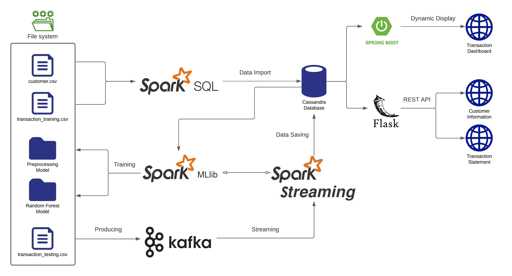

# Real-Time Credit Card Fraud Detection Pipeline

This project demonstrates a real-time big data pipeline to detect fraudulent credit card transactions. It integrates Apache Kafka, Apache Spark Streaming, Cassandra, and ML models to simulate, ingest, process, and classify transaction data in real-time.

## 🚀 Architecture

1. Simulate 100 customers' profiles and 10K+ transaction records.
2. Load data into Apache Cassandra using Spark SQL.
3. Train a Random Forest classifier using Spark MLlib.
4. Use Apache Kafka to stream new transaction data.
5. Run Spark Streaming jobs to classify live transactions as fraud or not.

## 🧠 Technologies Used

- Apache Spark (MLlib + SQL + Streaming)
- Apache Kafka
- Apache Cassandra
- Python (pyspark, kafka-python)
- Random Forest Classifier

## 📂 File Structure

- `Cassandra Keyspace.cql`: Cassandra schema setup
- `customer.csv`, `transaction_training.csv`, `transaction_testing.csv`: Simulated data
- `Cassandra Python/`: Contains ingestion and model training scripts
- `src/`: Contains Kafka producers and architecture diagram

## ⚙️ How to Run

1. Set up Kafka, Spark, and Cassandra locally or via Docker.
2. Load datasets into Cassandra.
3. Train the ML models.
4. Start Kafka producers for streaming transactions.
5. Run the Spark Streaming job to detect fraud.

## 📈 Output

- Fraud classification output printed/logged in real-time.
- Model files and logs stored for reuse and analysis.

## 🧑‍💻 Author

Built with 💡 by CAPTAINCODERCOOL

## 📄 License

MIT License
